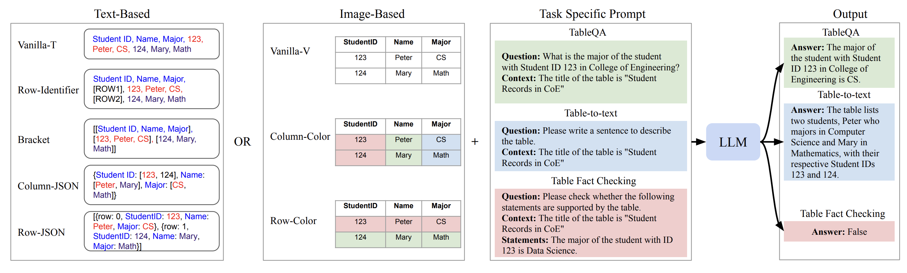
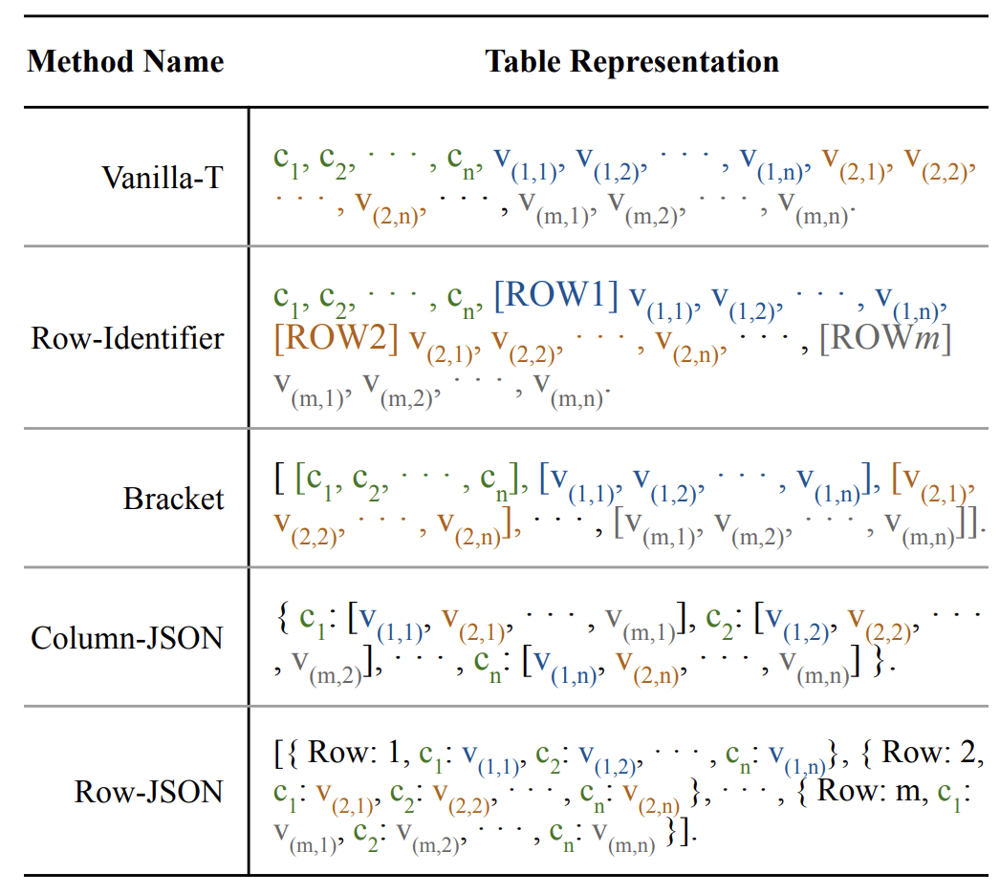
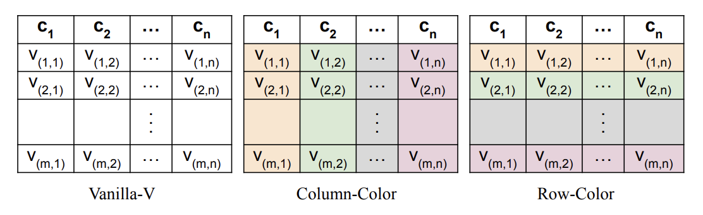
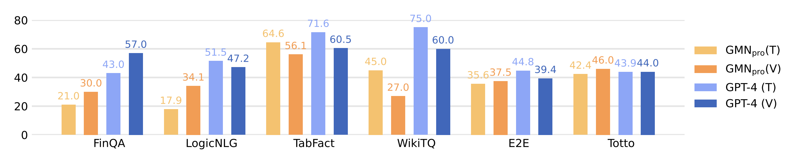

# LLMs-on-structured-data

[](https://aclanthology.org/2024.findings-acl.23.pdf) [](https://github.com/dnaihao/LLMs-on-structured-data/tree/main/data) [](https://github.com/dnaihao/LLMs-on-structured-data/tree/main/src)

## 1. Introduction



The evaluation of LLMs on processing tabular data involves many challenges. First, there are many ways to represent the information in tables. If we represent the table in pure text, we may use naive linearization or insert brackets to better represent table structures. Meanwhile, emerging multimodal LLMs like GPT-4 and Gemini offer image-based approaches, where we can pass the table as images to the LLMs. In such cases, visual cues like color highlighting in tables can influence outcomes. Second, diverse prompting methods for text may also apply to tabular data, which can yield varied results. Furthermore, the tasks involving tabular data are diverse, including table fact-checking and table question answering (Pasupat and Liang, 2015), and table-totext generation, etc.

Specifically, we investigate several research questions:

* Evaluate LLMs' and MLLMs' performance on tabular data.
* Compare the effectiveness of image-based representations v.s. text-based representations of tabular data.
* Compare the effectiveness of various text-based and image-based table representations.

## 2. Experimental Setup

### 2.1 Models

| Models         | # Parameters (Billion)    | Open Source? | +V? | Company  |
|:---------------:|:---------:|:----:|:---:|:--------:|
| Llama-2        | 7/13/70   | ✓   | ✗   | Meta     |
| GPT-3.5       | -         | ✗   | ✗   | OpenAI   |
| GPT-4         | -         | ✗   | ✓   | OpenAI   |
| Gemini\(_{pro}\) | -      | ✗   | ✓   | Google   |
| Llama-3        | 8/70      | ✓   | ✗   | Meta     |
| Gemma          | 2/7       | ✓   | ✓   | Meta     |
| GPT-4o        | -         | ✗   | ✓   | OpenAI   |

### 2.2 Prompting Strategies

Text-based prompting methods are as follows:



Image-based prompting methods are as follows:



On top of different table representations, we adopt vanilla prompting, chain-of-thought prompting, as well as expert prompting by adding “let’s pretend you are an expert in reading and understanding tables” to the prompt.


### 2.3 Datasets

| Task Family           | Name                            | Domain     | Input            | Output      | Metrics               |
|:----------------------:|:---------------------------------:|:------------:|:-------------------:|:-------------:|:-----------------------:|
| Table QA             | WikiTQ | Wikipedia  | Table             | Text        | Acc                   |
|                      | FinQA     | Finance    | Table + Text      | Text        | Acc                   |
| Table Fact Checking   | TabFact    | Wikipedia  | Table             | Boolean      | Acc                   |
| Table-to-text         | E2E    | Restaurants | Table             | Text        | ROUGE, Human          |
|                      | ToTTo    | Wikipedia  | Table + Text      | Text        | ROUGE                 |
|                      | LogicNLG   | Wikipedia  | Table + Text      | Entity      | Acc                   |


## 3. Results

### 3.1 Image v.s. Text Representation



**Take-away Message:** Image representation is effective, but the performance still lags behind text representation.

### 3.2 Other Research Questions
Please refer to our [paper](https://aclanthology.org/2024.findings-acl.23.pdf) for further information.


## 4. Other Details

### 4.1 Hierarchy of the Repository 

```
LLMs-on-structured-data
└── data
    ├── both_v_and_t
    ├── cleaned_complete_data
    │   ├── e2e_dataset_test
    │   └── ...
    └── complete_data
        ├── e2e_dataset_test
        └── ...
```

### 4.2 Evaluation

We note that the prediction evaluation can be complicated, as the zero-shot response from LLMs cannot exactly match the gold answer provided in the test set.
Therefore, we also employ manual examination into the model prediction in the performance calculation.


## Citation
```bibtex
@inproceedings{deng-etal-2024-tables,
    title = "Tables as Texts or Images: Evaluating the Table Reasoning Ability of {LLM}s and {MLLM}s",
    author = "Deng, Naihao  and
      Sun, Zhenjie  and
      He, Ruiqi  and
      Sikka, Aman  and
      Chen, Yulong  and
      Ma, Lin  and
      Zhang, Yue  and
      Mihalcea, Rada",
    editor = "Ku, Lun-Wei  and
      Martins, Andre  and
      Srikumar, Vivek",
    booktitle = "Findings of the Association for Computational Linguistics ACL 2024",
    month = aug,
    year = "2024",
    address = "Bangkok, Thailand and virtual meeting",
    publisher = "Association for Computational Linguistics",
    url = "https://aclanthology.org/2024.findings-acl.23",
    doi = "10.18653/v1/2024.findings-acl.23",
    pages = "407--426",
    abstract = "Tables contrast with unstructured text data by its structure to organize the information.In this paper, we investigate the efficiency of various LLMs in interpreting tabular data through different prompting strategies and data formats. Our analysis extends across six benchmarks for table-related tasks such as question-answering and fact-checking. We pioneer in the assessment of LLMs{'} performance on image-based table representation. Specifically, we compare five text-based and three image-based table representations, revealing the influence of representation and prompting on LLM performance. We hope our study provides researchers insights into optimizing LLMs{'} application in table-related tasks.",
}
```